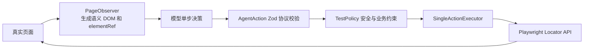

# Agent 动作协议扩展与决策失效问题复盘

## 1. 结论

本次问题不能简单归因于“模型不够聪明”或“Playwright 不支持这个操作”。动态测试中间隔着一层由 `quality-ai` 自己定义的 **Agent 动作协议**：模型只能从协议允许的动作中选一个，平台校验后再翻译成 Playwright API 执行。

此前协议适合简单表单，但不足以完整表达 B 端页面常见的键盘下拉、悬浮菜单、滚动容器、禁用态、选中态、展开态、列表数量等行为。模型一旦输出协议之外的动作，Zod 会在执行 Playwright 之前直接拒绝，表现为：

```text
No matching discriminator
path: ["action", "action"]
```

本次采用“受约束的领域动作协议”方案，新增 10 个动作，并同步修改协议、模型提示、执行器、策略、轨迹 UI 和自动化测试。动作总数由 11 个扩展为 21 个，同时仍禁止 CSS、XPath、任意 JavaScript 和无限制键盘指令。

## 2. 名词和代码归属

以下概念容易混在一起，需要先区分哪些属于本项目，哪些属于 Playwright。

| 名称 | 归属 | 作用 |
| --- | --- | --- |
| `AgentAction` / `agentActionSchema` | `quality-ai` 本地代码 | 定义模型可以输出的动作名、字段和取值范围 |
| `ResponsesDecisionProvider` | `quality-ai` 本地代码 | 把测试目标、当前 DOM、轨迹和源码上下文交给模型，要求模型只返回一个合法动作 |
| `TestPolicy` | `quality-ai` 本地代码 | 在执行前校验同源限制、元素引用、断言 ID、步骤预算和重复动作 |
| `PageObserver` | `quality-ai` 本地代码 | 从真实页面提取精简语义 DOM，并给当前可交互元素分配 `e1`、`e2` 等引用 |
| `ElementRegistry` | `quality-ai` 本地代码 | 把某次快照中的 `elementRef` 稳定绑定到真实 DOM 节点 |
| `SingleActionExecutor` | `quality-ai` 本地代码 | 把一个合法 Agent 动作翻译成 Playwright 调用，并返回统一执行结果 |
| `Locator`、`click()`、`press()`、`hover()` 等 | Playwright | 真正驱动浏览器的底层 API |
| Zod `discriminatedUnion` | 第三方校验库 | 根据 `action.action` 判断属于哪一种本地动作结构 |

完整链路如下：



所以：

- `invalid_union / No matching discriminator` 是本地动作协议校验失败，Playwright 还没有开始执行。
- `locator.click: Timeout` 是协议和策略已经通过，Playwright 在真实页面执行时失败。
- “项目源码上下文请求超过预算”是本地 `TestPolicy` 阻止 Agent 继续读取源码，与 Playwright 无关。

## 3. 这次现象为什么会发生

### 3.1 直接原因

模型返回的 `action.action` 不在当时允许的 11 个动作名中，或者动作名正确但字段结构不属于该动作。Zod 通过 `action` 字段做分支判断时找不到对应分支，于是报告：

```text
discriminator: "action"
path: ["action", "action"]
```

第一个 `action` 表示决策类型是动作决策，第二个 `action` 才是具体动作名。

### 3.2 深层原因

旧协议的表达能力不够，而模型面对的是复杂 B 端组件。例如下拉框可能需要：

1. 点击或键盘聚焦组合框；
2. 按 `ArrowDown` 或 `Enter`；
3. 检查 `aria-expanded=true`；
4. 检查选项数量；
5. 检查目标选项文本；
6. 选择后检查输入值或选中态。

旧协议只能 `click`、`fill`、`expectText`。模型知道“应该按回车、判断展开态或检查列表数量”，但平台没有对应表达方式。它只能尝试创造新动作，或者用弱断言绕过，最终产生协议错误或误判。

### 3.3 为什么界面显示“0 个断言通过”

界面的这个数字不是“PRD 一共有多少条用例通过”，而是本次 Agent 测试目标中的 `requiredAssertions` 已经成功执行了多少个。

`goto`、`click`、`waitFor` 即使执行成功，也只是操作步骤，不计入断言。只有带合法 `assertionId` 的 `expect*` 动作成功后才累计。因此 Agent 花了多轮找路由和等待页面，却在第一个有效断言之前发生协议错误时，会显示“6 轮 · 0 个断言通过”。

## 4. 修改前后对比

### 4.1 能力对比

| 场景 | 修改前 | 修改后 |
| --- | --- | --- |
| 键盘下拉、回车搜索、Esc 关闭 | 无法表达，模型容易创造 `type`、`keyboard` 等动作 | `press`，且按键使用固定白名单 |
| 悬浮显示菜单或提示 | 无法表达 | `hover` |
| 页面或内部容器滚动 | 依赖点击或重复等待，可能永远看不到目标 | `scroll`，支持页面和元素容器，单次位移有限制 |
| 验证弹窗/加载态消失 | 只能间接检查其他文字 | `expectHidden`，支持元素引用、文本和 ARIA role |
| 验证按钮可用/禁用 | 只能看 DOM 描述，不能形成通过断言 | `expectEnabled` / `expectDisabled` |
| 验证复选框、单选框、开关状态 | 只能执行 `check`，无法精确验证结果 | `expectChecked` |
| 验证某个组件内部文本 | `expectText` 只检查全页面，可能命中错误区域 | `expectElementText` 绑定当前元素 |
| 验证展开、选中等 ARIA 状态 | 无法表达 | `expectAttribute`，属性使用安全白名单 |
| 验证表格行、下拉项、菜单项数量 | 无法表达 | `expectCount`，按可选容器、ARIA role 和可访问名称统计 |
| 模型输出未知动作 | Zod 原始错误不易理解 | Provider 最多修复 3 次，并返回明确的合法动作列表 |

### 4.2 动作清单

保留的原有动作：

- 导航与交互：`goto`、`click`、`fill`、`selectOption`、`check`、`uncheck`
- 断言：`expectVisible`、`expectValue`、`expectText`
- 辅助：`waitFor`、`screenshot`

本次新增动作：

- 交互：`press`、`hover`、`scroll`
- 断言：`expectHidden`、`expectEnabled`、`expectDisabled`、`expectChecked`、`expectElementText`、`expectAttribute`、`expectCount`

### 4.3 典型下拉框执行前后

修改前可能出现：

```text
click 选择考试
waitFor 2000ms
模型尝试输出 observe / reload / keyboard
动作协议校验失败
```

修改后可以表达为：

```text
click 组合框
expectAttribute aria-expanded = true
expectCount role=option count=N
press ArrowDown
press Enter
expectValue = 选中的考试
```

注意：这并不表示每个下拉框都必须走键盘。原生 `select` 优先使用 `selectOption`；可访问性良好的自定义组合框可以使用 `click + press + ARIA 断言`；Agent 应根据当前真实 DOM 选择最短路径。

## 5. 多种方案对比

| 方案 | 做法 | 优点 | 风险/缺点 | 结论 |
| --- | --- | --- | --- | --- |
| A. 只修改模型 Prompt | 告诉模型不要输出未知动作 | 改动小 | 无法解决协议本身表达不了键盘、状态和数量的问题；模型只能换一种错误方式 | 不采用 |
| B. 允许模型直接输出任意 Playwright 或 JavaScript | 模型生成 selector 和代码后立即执行 | 能力最全、扩展快 | 可执行任意代码；容易越过同源、元素引用和副作用限制；难审计、难稳定复现 | 不采用 |
| C. 扩展受约束的领域动作协议 | 为高频 B 端行为增加结构化动作，再映射 Playwright | 能力、稳定性、安全性和可观测性平衡；每一步可校验、可展示、可复现 | 每增加动作要同步六层并补测试 | 本次采用 |
| D. 让模型一次生成完整 Playwright 脚本 | 生成脚本后统一运行 | 对固定流程执行效率较高 | 失去“观察—决策—执行—重观测”闭环；页面变化后旧定位连续失效；失败恢复差 | 可作为固定用例生成模式，不替代动态 Agent |
| E. 不增加动作，只增强 DOM | 给模型更多 DOM 和源码 | 有利于判断目标元素 | “看得见”不等于“做得到/验得到”；仍无法表达缺失行为 | 作为配套能力，不是单独解法 |

选择方案 C 的核心原因不是动作越多越好，而是只补充业务中已经反复出现、可以安全约束、可以稳定映射 Playwright、可以形成明确测试证据的动作。

## 6. 本次实现的安全边界

### 6.1 键盘动作

`press` 仅允许以下按键：

```text
Enter Escape Tab ArrowUp ArrowDown ArrowLeft ArrowRight
Home End PageUp PageDown Backspace Delete Space
```

不接受任意组合键或文本，也不把模型输入拼接成 JavaScript。文本输入继续使用 `fill`。

### 6.2 滚动动作

- `deltaX`、`deltaY` 限制在 `-3000` 到 `3000`；
- 可以滚动当前页面，也可以滚动当前快照中的 `elementRef`；
- 执行后重新观察 DOM，不能沿用旧快照盲目点击；
- 连续重复相同滚动仍受 `TestPolicy` 限制。

### 6.3 属性断言

只允许测试常用、不会触发执行的属性：

```text
aria-checked aria-current aria-disabled aria-expanded aria-invalid
aria-selected class data-state role
```

不允许模型读取或构造 `onclick` 等任意属性。

### 6.4 定位边界

- 交互动作继续优先使用当前语义快照中的 `elementRef`；
- 语义观察器会返回 `listbox`、`grid`、`menu`、`tree` 等可滚动复合组件容器，避免只有子选项、没有滚动目标；
- 消失断言额外允许文本或 ARIA role，因为元素消失后不会出现在新快照里；
- 数量断言只允许受控的 ARIA role 和可选可访问名称；
- 数量断言可用 `containerRef` 限定在某个表格、列表或菜单内，避免命中页面其他同类元素；
- 不开放 CSS、XPath 和任意 DOM 查询给动态 Agent。

## 7. 为什么暂时不加入上传和下载动作

`uploadFile` 和 `expectDownload` 本身是合理需求，但它们不只是“再调一个 Playwright 方法”：

- 上传涉及文件路径从哪里来、允许访问哪些目录、测试资产如何版本化；
- 需要限制文件大小、类型和单次上传数量；
- 下载涉及等待时机、文件落盘目录、重名覆盖、内容和文件名断言；
- 两者都会产生比点击、输入更明显的文件系统副作用。

因此建议作为独立批次实现“测试资产 Provider + 上传/下载动作”，而不是为了增加动作数量直接开放本机路径。这样仍符合当前 Provider 思路：Agent 只引用资产 ID，由受信任 Provider 将 ID 解析到白名单目录中的具体文件。

## 8. 这次改动涉及的六层

| 层 | 修改内容 |
| --- | --- |
| 协议层 | 在 `shared/contracts.ts` 定义新增动作结构、枚举、默认值和范围 |
| 决策层 | 在 `ResponsesDecisionProvider` 中列出精确 JSON 格式和选择规则 |
| 策略层 | 在 `TestPolicy` 校验元素存在性、可用性、断言 ID、重复动作和同源边界 |
| 执行层 | 在 `SingleActionExecutor` 映射 Playwright，并为精确断言增加有限轮询 |
| 展示层 | 在执行轨迹中展示按键、滚动位移、断言目标和期望值 |
| 验证层 | 增加真实 Chromium 回归、协议安全用例和策略边界用例 |

以后增加任何动作也应遵循这六层检查。只改 Prompt 会让模型输出通过不了协议；只改协议会让执行器落入错误分支；只改执行器则模型根本不知道动作存在。

## 9. 后续建议顺序

1. 用当前“选择考试”真实场景回归新增动作，确认模型会选择 `click / press / expectAttribute / expectCount / expectValue` 中的合理组合。
2. 根据真实轨迹统计动作选择频率和失败率，不根据想象继续堆动作。
3. 增加测试资产 Provider，再实现 `uploadFile`、`expectDownload` 和下载内容断言。
4. 对日期选择器、级联选择、虚拟列表等高频 B 端组件建立小型组件基准集，持续回归语义 DOM 与动作协议。
5. 当某类流程稳定后，再把成功轨迹固化为普通 Playwright 用例；动态 Agent 负责探索和修复，固定脚本负责高频稳定回归。

## 10. 判断新动作是否值得加入的标准

后续不是模型输出什么未知动作就补什么动作。一个动作至少应同时满足：

1. 真实业务中反复出现；
2. 现有动作无法安全组合表达；
3. 输入字段可以严格校验和限制；
4. 能映射到确定的 Playwright 行为；
5. 执行结果可以在轨迹中清楚解释；
6. 能编写稳定的浏览器回归测试；
7. 不绕过当前的同源、快照、元素引用和副作用边界。

这套标准比追求“动作全面”更重要。动态 Agent 的目标不是复刻 Playwright 全部 API，而是形成一套覆盖主要业务行为、出错时容易定位、执行时可控的测试语言。
